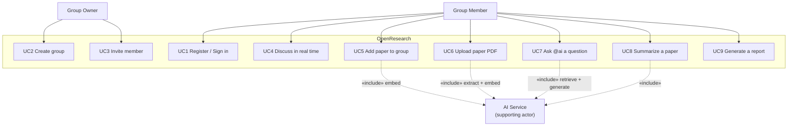

# Software Requirements Specification (SRS)

## OpenResearch — Collaborative Research Platform with Group-Scoped RAG

**Document Version:** 2.0
**Date:** July 2026
**Supersedes:** v1.0 (February 2026), which specified a broader scope since
deliberately reduced — see [ADR 0005](adr/0005-scope-cut.md).

---

## Table of Contents

1. [Introduction](#1-introduction)
2. [Overall Description](#2-overall-description)
3. [Specific Requirements](#3-specific-requirements)
4. [Non-functional Requirements](#4-non-functional-requirements)
5. [Appendix](#5-appendix)

---

## 1. Introduction

### 1.1 Purpose

This document specifies the requirements for **OpenResearch**, a web platform on
which research teams share academic papers, discuss them in real time, and
question an AI assistant that answers **only from the papers that team has
collected**, citing the passages it used.

It is written for the developers, examiners, and reviewers of the system, and
describes the software as it is actually implemented at version 2.0.

### 1.2 Scope

OpenResearch allows a group of researchers to:

- form a **group** and invite members to it;
- collect **papers** into that group, by arXiv search or by uploading a PDF;
- hold **real-time discussions** in threaded sessions;
- ask an **AI assistant** questions, by mentioning `@ai`, and receive an answer
  retrieved from that group's papers and accompanied by citations;
- generate a **PDF report** summarising the group's activity.

**The central requirement, from which most others follow, is group isolation.**
A group's papers, discussions, and AI-generated content are visible only to its
members, and the retrieval that produces an AI answer is confined to that
group's material. This is a security boundary, not a convenience filter.

**Out of scope (v2.0).** The following were specified in v1.0 and have been
deliberately removed: autonomous agentic task execution, multi-step workflows
with human checkpoints, citation-graph and claim-lineage visualisation,
methodology comparison matrices, paper recommendation, and a friends/social
graph. The reasoning is recorded in [ADR 0005](adr/0005-scope-cut.md). Optical
character recognition of scanned PDFs is also out of scope.

### 1.3 Definitions, Acronyms, and Abbreviations

| Term | Definition |
|---|---|
| **RAG** | Retrieval-Augmented Generation. The LLM is given passages retrieved from a corpus and answers from them, rather than from its own parameters alone. |
| **Embedding** | A text passage represented as a 768-dimensional vector, such that passages of similar meaning lie close together. |
| **Chunk** | A ~1000-character passage of a paper: the unit that is embedded and retrieved. |
| **pgvector** | The PostgreSQL extension providing the `vector` column type and similarity operators. |
| **HNSW** | Hierarchical Navigable Small World: the index that makes vector similarity search fast without scanning every row. |
| **BM25** | The classical keyword-relevance ranking function, provided here by PostgreSQL full-text search. |
| **RRF** | Reciprocal Rank Fusion: combining two rankings by rank position rather than by score. |
| **`@ai` trigger** | The literal string `@ai` in a message. The assistant responds if and only if it is present. |
| **Group isolation** | The guarantee that retrieval and access are confined to a single group. |
| **JWT** | JSON Web Token, the bearer credential used for authentication. |

### 1.4 References

- IEEE Std 830-1998, *Recommended Practice for Software Requirements Specifications*
- Architecture Decision Records: [`docs/adr/`](adr/)
- Database schema: [`docs/database-schema.md`](database-schema.md)
- Realtime protocol: [`docs/socket-io-events.md`](socket-io-events.md)
- Cormack et al., *Reciprocal Rank Fusion Outperforms Condorcet and Individual Rank Learning Methods* (2009)

### 1.5 Overview

Section 2 describes the system in general terms and the constraints it operates
under. Section 3 states the functional requirements and the principal use case.
Section 4 states the non-functional requirements. Section 5 provides the API and
database summaries and a traceability matrix.

---

## 2. Overall Description

### 2.1 Product Perspective

OpenResearch is a new, self-contained system deployed as three cooperating
services over a single PostgreSQL database.

```
┌──────────────┐   REST    ┌──────────────────┐   HTTP    ┌─────────────────┐
│  Web client  │◄─────────►│  Application     │◄─────────►│  AI service     │
│  (Next.js)   │           │  server          │           │  (FastAPI)      │
│              │ WebSocket │  (Node/Express)  │           │                 │
│  browser     │◄─────────►│  + Socket.IO     │           │  RAG + LLM      │
└──────────────┘           └────────┬─────────┘           └────────┬────────┘
                                    │                              │
                                    ▼                              ▼
                          ┌────────────────────────────────────────────┐
                          │  PostgreSQL 16 + pgvector                  │
                          │  relational data + the 768-dim RAG index   │
                          └────────────────────────────────────────────┘
                                             │
                                             ▼
                            external: arXiv, embedding and LLM APIs
```

Two structural constraints govern this arrangement:

- **The browser never contacts the AI service.** All AI requests are proxied by
  the application server, which is therefore the single place where
  authorization, rate limiting, and the `@ai` gate are enforced.
- **Only the application server may define the database schema.** All DDL is a
  Drizzle migration; the AI service reads and writes rows and issues none. See
  [ADR 0001](adr/0001-service-boundaries.md).

### 2.2 Product Functionality

| # | Function |
|---|---|
| F1 | Register, authenticate, and manage a user profile |
| F2 | Create research groups; invite, accept, decline, and remove members |
| F3 | Create discussion sessions within a group and exchange messages in real time |
| F4 | Search arXiv, save papers to the library, and attach papers to a group |
| F5 | Upload a paper as a PDF; the system extracts, chunks, and indexes its text |
| F6 | Ask the AI assistant a question with `@ai`; receive a streamed answer retrieved from the group's papers, with citations |
| F7 | Ask a question about, or request a summary of, a single paper |
| F8 | Generate a PDF report of a group's papers, discussions, and AI outputs |

### 2.3 User Classes and Characteristics

| Class | Description | Privileges |
|---|---|---|
| **Anonymous visitor** | Not authenticated | The landing page and the sign-in/sign-up pages only |
| **Group member** | Authenticated; belongs to a group | Full read/write within that group: papers, sessions, messages, AI features |
| **Group owner** | The member who created the group | Everything a member may do, plus: rename and delete the group, add and remove members, clear a session's messages |

Users are assumed to be researchers or students: technically capable, but not
required to understand retrieval or embeddings in order to use the system.

### 2.4 Operating Environment

- **Server side:** Docker; PostgreSQL 16 with the `pgvector` extension; Node.js
  20; Python 3.12.
- **Client side:** any modern browser with WebSocket support.
- **External dependencies:** an embedding API (Gemini `gemini-embedding-001`), a
  chat LLM API (DeepSeek, with Groq as fallback), and the public arXiv API.

### 2.5 Design and Implementation Constraints

| # | Constraint |
|---|---|
| C1 | Embeddings **must** be 768-dimensional. The database column is `vector(768)` and its HNSW index is built for that width; a model of any other width cannot be substituted without a migration and a full re-index. |
| C2 | Every retrieval query **must** filter by `group_id` inside the SQL `WHERE` clause, not by discarding results afterwards. |
| C3 | The AI **must not** respond to any message lacking the `@ai` trigger. |
| C4 | The AI service **must not** issue DDL. |
| C5 | Access tokens are short-lived (15 minutes); the refresh token is delivered only as an `httpOnly` cookie and is never readable by client-side JavaScript. |
| C6 | The system must remain usable when an external AI provider fails: it degrades, it does not crash (NFR-R1). |

### 2.6 Assumptions and Dependencies

- Users supply their own API keys for the embedding and LLM providers.
- Uploaded PDFs contain a text layer; scanned images are rejected with a clear
  message rather than indexed as empty.
- The free tiers of the external APIs suffice for the expected load; rate
  limiting is absorbed by retry with exponential backoff.

---

## 3. Specific Requirements

### 3.1 External Interface Requirements

#### 3.1.1 User Interfaces

A responsive web interface with light and dark themes. Its principal screens:

| Screen | Route | Purpose |
|---|---|---|
| Sign in / Sign up | `/auth/signin`, `/auth/signup` | Authentication |
| Groups | `/home` | List and create groups |
| Group | `/group/[id]` | Members, sessions, invitations |
| Research workspace | `/research/[sessionId]` | Three panes: sources, chat, workspace |
| Group papers | `/group-papers/[groupId]` | The group's papers; PDF upload |
| Paper library | `/paper` | arXiv search, saved papers |
| Reports | `/reports/[groupId]` | Generate and download reports |
| Invitations | `/invitations` | Accept or decline invitations |

The research workspace is the primary screen. An AI answer streams in token by
token and, on completion, displays **citation chips** naming the passages that
grounded it, with their retrieval scores.

#### 3.1.2 Software Interfaces

| Interface | Protocol | Purpose |
|---|---|---|
| Client ↔ Server | HTTPS REST (JSON) | CRUD |
| Client ↔ Server | WebSocket (Socket.IO) | Chat and the streamed AI answer |
| Server ↔ AI service | HTTP; NDJSON for streams | Retrieval and generation |
| Server, AI service ↔ PostgreSQL | TCP | Data and vector search |
| AI service ↔ Gemini | HTTPS | Embeddings |
| AI service ↔ DeepSeek / Groq | HTTPS | Chat completion |
| Server ↔ arXiv | HTTPS (Atom XML) | Paper search |

#### 3.1.3 Communications Interfaces

The AI service streams NDJSON: one JSON object per line — `{"token": "..."}` per
token, terminated by `{"done": true, "sources": [...], "latency_ms": N}`. The
application server relays each token to the browser as a Socket.IO `ai:token`
event and the final frame as `ai:token:done`. A correlation ID accompanies every
request across all three tiers.

### 3.2 Functional Requirements

#### Authentication and user management

| ID | Requirement |
|---|---|
| FR-A1 | The system shall register a user with a name, a unique email, and a password of at least 6 characters. |
| FR-A2 | Passwords shall be stored only as bcrypt hashes (cost factor 12). |
| FR-A3 | On authentication the system shall issue a 15-minute access token and a 7-day refresh token, **signed with different secrets**. |
| FR-A4 | The refresh token shall be delivered only as an `httpOnly`, `SameSite=Lax` cookie scoped to `/api/auth`, and shall never appear in a response body. |
| FR-A5 | Presenting a refresh token shall rotate it: the presented token is revoked and a new pair issued. A revoked token shall be rejected. |
| FR-A6 | Every route other than authentication and health shall require a valid access token. |

#### Group management and authorization

| ID | Requirement |
|---|---|
| FR-G1 | Any authenticated user may create a group, and becomes its owner. |
| FR-G2 | The system shall reject any request to read or write a group's data from a user who is not a member of it. |
| FR-G3 | Only the owner may rename or delete a group, add or remove members, or clear a session's messages. |
| FR-G4 | A member may invite a user by email; the invitee may accept or decline. Accepting grants membership. |
| FR-G5 | The system shall reject a duplicate invitation, and an invitation to an existing member. |

#### Real-time communication

| ID | Requirement |
|---|---|
| FR-C1 | A member may create discussion sessions within a group. |
| FR-C2 | Messages shall be delivered in real time to all members present in a session. |
| FR-C3 | The system shall indicate which users are currently typing. |
| FR-C4 | The WebSocket connection shall be authenticated at handshake, and every event payload validated before use. |
| FR-C5 | A user may delete their own messages; the group owner may delete any message. |

#### Papers

| ID | Requirement |
|---|---|
| FR-P1 | A user may search arXiv and import a result into the paper library. |
| FR-P2 | A user may save papers, annotate them, and filter the library by tag. |
| FR-P3 | A member may attach a paper to a group, whereupon the system shall embed it into that group's index. |
| FR-P4 | A member may upload a paper as a PDF (≤ 20 MB). The system shall extract its text, chunk it, embed it, and store it. |
| FR-P5 | A PDF with no extractable text layer shall be rejected with an explanatory message. |

#### AI assistant — the flagship

| ID | Requirement |
|---|---|
| FR-AI1 | No AI activity shall occur without explicit user intent. In chat, that intent is the `@ai` mention: a message without it produces no AI activity whatsoever. Invoking the research agent is itself an explicit act (a dedicated control), so it does not additionally require the mention — requiring both would be theatre, not a safeguard. |
| FR-AI2 | On an `@ai` message, the system shall retrieve relevant passages **from that group's papers only**. |
| FR-AI3 | Retrieval shall be hybrid: vector similarity and BM25 keyword ranking, combined by Reciprocal Rank Fusion ([ADR 0004](adr/0004-hybrid-retrieval.md)). |
| FR-AI4 | The answer shall be streamed to the browser token by token. |
| FR-AI5 | On completion the system shall return the passages that grounded the answer, and the interface shall display them as citations with their retrieval scores. |
| FR-AI6 | The answer and its metadata shall be persisted as a message, so that reopening the session shows it and its citations. |
| FR-AI7 | A member may ask a question about, or request a summary of, an individual paper (both `@ai`-gated). |
| FR-AI9 | A member may invoke a **research agent** that investigates with tools — searching the group's papers, searching arXiv for what they do not cover, and reading a paper in full — over several iterations, then answers with citations. Its reasoning shall be streamed and persisted, so the user can see and later inspect how the answer was reached. |
| FR-AI8 | If no AI provider is configured or reachable, the system shall report this to the user and continue to function as a chat platform. |

#### Reports

| ID | Requirement |
|---|---|
| FR-R1 | A member may generate a PDF report of a group's papers, discussions, and AI outputs. |
| FR-R2 | A report shall be downloadable only by a member of the group it belongs to, and only through the application server. |

### 3.3 Use Case Model



#### UC7 — Ask `@ai` a question *(primary use case)*

| | |
|---|---|
| **Actor** | Group member |
| **Precondition** | The member is in a session of a group that has at least one indexed paper. |
| **Trigger** | The member sends a message containing `@ai`. |

**Main flow**

1. The member sends `@ai which architecture does this paper propose?`
2. The server verifies group membership and persists the message.
3. The server broadcasts the message to the session and creates an empty AI
   message, so the assistant's reply appears immediately as a placeholder.
4. The server calls the AI service with the prompt, group, and session.
5. The AI service embeds the question and retrieves the top passages **from that
   group's index**, using hybrid vector + BM25 search fused by RRF.
6. The AI service builds a prompt from the retrieved passages and the recent
   conversation, and streams the LLM's response back as NDJSON.
7. The server relays each token to every member present in the session.
8. On the final frame, the server persists the completed answer with its source
   metadata and signals completion.
9. The interface renders the answer and, beneath it, one citation chip per source
   passage, showing the paper title and the retrieval score.

**Alternative flows**

- *3a. No `@ai` trigger* — no AI activity occurs; the message is an ordinary chat
  message.
- *5a. The group has no indexed papers* — retrieval returns nothing; the
  assistant answers from the conversation alone and returns no citations.
- *6a. The primary LLM fails* — the request is retried, then replayed against the
  fallback provider. If both fail, an `ai:error` is emitted and the chat
  continues to function.

**Postcondition** — The answer is persisted as a message, visible with its
citations to every member of the group.

---

## 4. Non-functional Requirements

### 4.1 Performance

| ID | Requirement |
|---|---|
| NFR-P1 | A vector search over a group's index shall be served by the HNSW index, not by a sequential scan. |
| NFR-P2 | The first token of an AI answer should reach the user within roughly 2 seconds; the answer streams thereafter, so the user is never shown a blank spinner. |
| NFR-P3 | Ingesting a paper shall embed all of its chunks in a single batched API call and write them in a single transaction. |
| NFR-P4 | Foreign-key columns used in hot query paths shall be indexed (PostgreSQL does not do so automatically). |
| NFR-P5 | The AI service shall start in seconds, not minutes; it shall load no machine-learning model at boot. |

### 4.2 Safety and Security

| ID | Requirement |
|---|---|
| NFR-S1 | **Group isolation.** Every retrieval query and every group-scoped route shall be confined to a group of which the requester is a member. This is enforced in SQL and in middleware, never in the interface alone. |
| NFR-S2 | Passwords shall be stored only as bcrypt hashes. |
| NFR-S3 | Access tokens shall expire in 15 minutes; refresh tokens shall be `httpOnly` and revocable. A stolen access token is therefore short-lived, and a refresh token is unreachable by injected script. |
| NFR-S4 | All request bodies, query parameters, and WebSocket payloads shall be schema-validated before use. |
| NFR-S5 | Error responses shall not disclose stack traces or internal messages; the detail is logged server-side against a correlation ID. |
| NFR-S6 | Secrets shall be supplied by environment and never committed. |
| NFR-S7 | Rate limits shall apply to authentication, search, chat, and report generation. |
| NFR-S8 | Containers shall run as a non-root user. |

### 4.3 Reliability

| ID | Requirement |
|---|---|
| NFR-R1 | **The system degrades rather than fails.** An embedding-API failure retries with backoff and then falls back to a deterministic vector; an LLM failure retries and then falls back to the secondary provider; a full-text-search failure falls back to vector-only retrieval. |
| NFR-R2 | Database migrations shall be applied transactionally, exactly once, and recorded. |
| NFR-R3 | Each service shall expose a health endpoint reporting the state of its dependencies. |

### 4.4 Maintainability and Verifiability

| ID | Requirement |
|---|---|
| NFR-M1 | The database schema shall have exactly one owner (the application server). |
| NFR-M2 | Authorization shall be enforced by shared middleware, not repeated per route. |
| NFR-M3 | Server tests shall run against a real PostgreSQL instance with pgvector, migrated with the migrations the system ships with. Mocking the database is not acceptable: the schema and its constraints are part of what must be verified. |
| NFR-M4 | Tests of AI behaviour shall mock the external providers, so that the suite requires no API keys and incurs no cost. |
| NFR-M5 | A correlation ID shall make a single user action traceable across all three services. |
| NFR-M6 | Every significant design decision shall be recorded as an ADR. |

---

## 5. Appendix

### Appendix A — API summary

**Authentication** — `POST /api/auth/register`, `/login`, `/refresh`, `/logout`;
`GET|PATCH /api/auth/me`

**Groups** — `GET|POST /api/groups`; `GET|PATCH|DELETE /api/groups/:groupId`;
`GET|POST /api/groups/:groupId/members`;
`DELETE /api/groups/:groupId/members/:memberId`;
`GET|POST /api/groups/:groupId/invitations`;
`GET /api/groups/invitations/pending`;
`POST /api/groups/invitations/:id/accept|decline`

**Sessions** — `POST /api/sessions`; `GET /api/sessions/group/:groupId`;
`GET|PATCH|DELETE /api/sessions/:sessionId`;
`GET|DELETE /api/sessions/:sessionId/messages`

**Papers** — `GET|POST /api/papers`; `GET /api/papers/search/external`;
`POST /api/papers/import`; `GET /api/papers/saved`;
`POST|DELETE /api/papers/:paperId/save`; `GET /api/papers/meta/tags`

**Group papers and AI** — `GET|POST /api/groups/:groupId/papers`;
`POST /api/groups/:groupId/papers/upload`;
`POST /api/groups/:groupId/papers/:paperId/question|summarize`;
`POST /api/groups/:groupId/search`

**Reports** — `POST /api/reports/group/:groupId/generate`;
`GET /api/reports/group/:groupId`; `GET /api/reports/:reportId[/download]`

**WebSocket** — client → server: `join:session`, `leave:session`,
`message:send`, `typing:start|stop`. Server → client: `message:new`, `ai:token`,
`ai:token:done`, `ai:error`, `user:typing`.

### Appendix B — Database summary

Thirteen tables; full detail in [`database-schema.md`](database-schema.md).

`users`, `groups`, `group_members`, `group_invitations`, `sessions`, `messages`,
`refresh_tokens`, `papers`, `saved_papers`, `group_papers`,
`group_paper_vectors`, `ai_artifacts`, `group_reports`

The table carrying the flagship feature is **`group_paper_vectors`**: one row per
chunk, holding the `content`, a `vector(768)` `embedding` (HNSW index), a
generated `content_tsv` (GIN index), and the `group_id` on which every query
filters.

### Appendix C — Requirements traceability

| Requirement | Realised in |
|---|---|
| FR-A3, FR-A4, FR-A5 | `server/src/middleware/auth.ts`, `server/src/routes/auth.ts` |
| FR-G2, FR-G3 | `server/src/middleware/groupAccess.ts` |
| FR-C4 | `server/src/socket/index.ts`, `server/src/validation/schemas.ts` |
| FR-AI1 | `ai-service/app/deps.py` (`validate_ai_trigger`) and the Pydantic validators |
| FR-AI2, FR-AI3, NFR-S1 | `ai-service/app/vector_store.py` (`hybrid_search_group_vectors`) |
| FR-AI4, FR-AI5 | `ai-service/app/routers/chat.py`, `server/src/services/aiChatService.ts` |
| FR-P4, FR-P5 | `ai-service/app/routers/papers.py` (`extract_pdf_text`) |
| NFR-R1 | `ai-service/app/embeddings.py`, `ai-service/app/llm_client.py` |
| NFR-M3 | `server/tests/` — 32 integration tests against a real PostgreSQL |
