# UML Diagrams — OpenResearch Platform

**Document Version:** 1.0
**Date:** February 10, 2026
**Project:** OpenResearch — Collaboration-First Research Platform

---

## Table of Contents

1. [Use Case Diagram](#1-use-case-diagram)
2. [Class Diagram](#2-class-diagram)
3. [Activity Diagram](#3-activity-diagram)
4. [Sequence Diagram](#4-sequence-diagram)
5. [State Chart (State Machine) Diagram](#5-state-chart-diagram)
6. [Component Diagram](#6-component-diagram)
7. [Deployment Diagram](#7-deployment-diagram)

---

## 1. Use Case Diagram

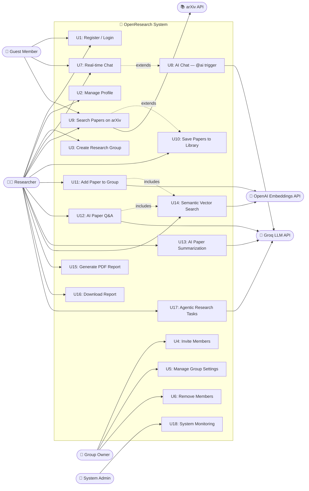

---

## 2. Class Diagram

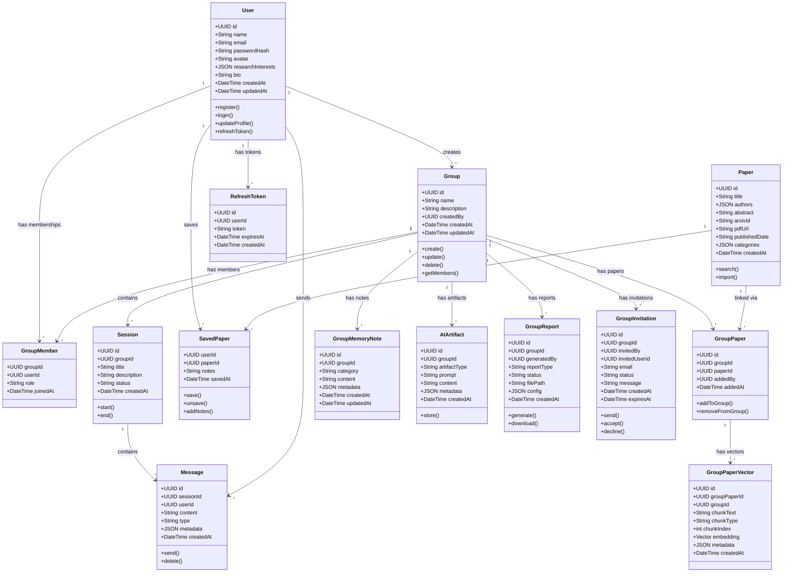

---

## 3. Activity Diagram

### 3.1 AI Paper Q&A Activity

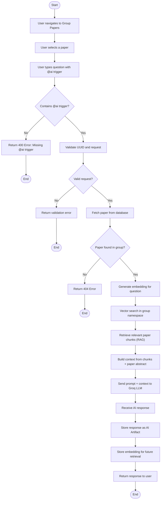

### 3.2 User Registration & Authentication Activity

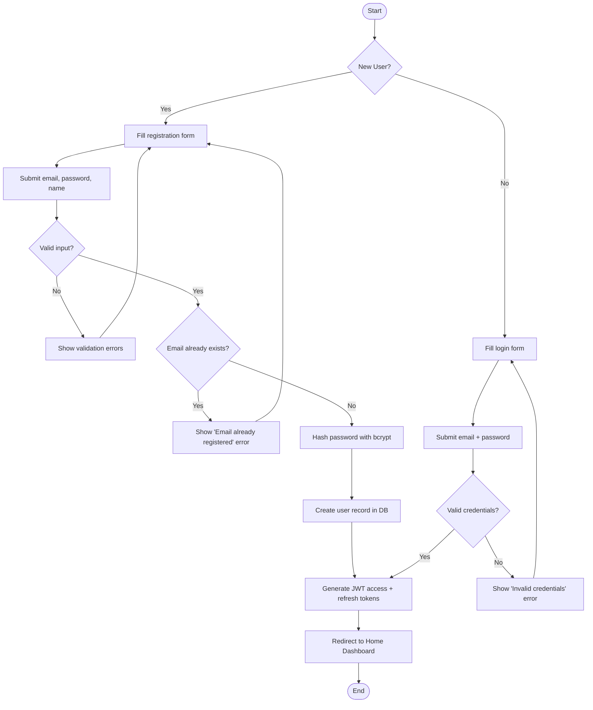

---

## 4. Sequence Diagram

### 4.1 Real-time Chat with AI (@ai trigger)

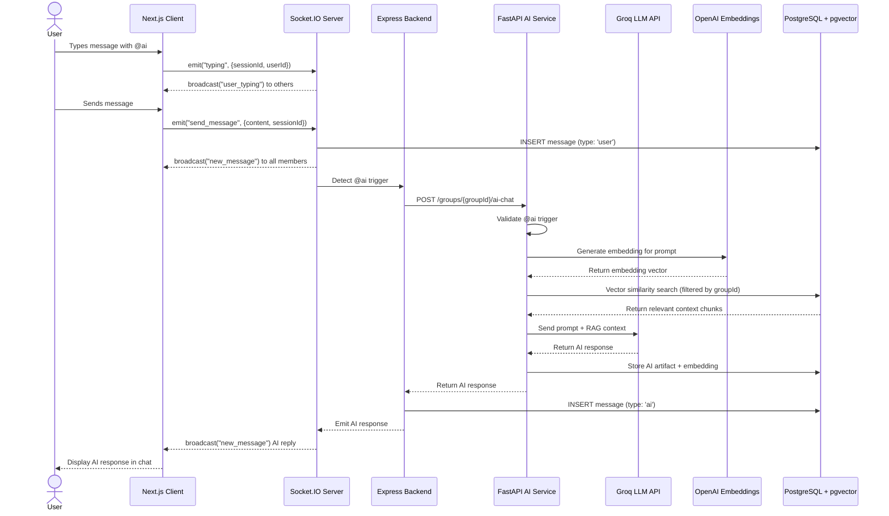

### 4.2 Paper Search, Save & Embed

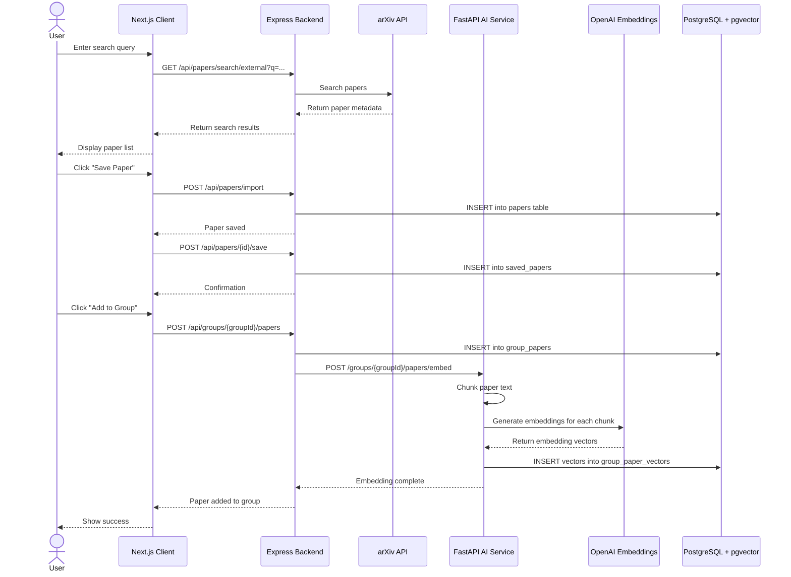

---

## 5. State Chart (State Machine) Diagram

### 5.1 Group Session Lifecycle

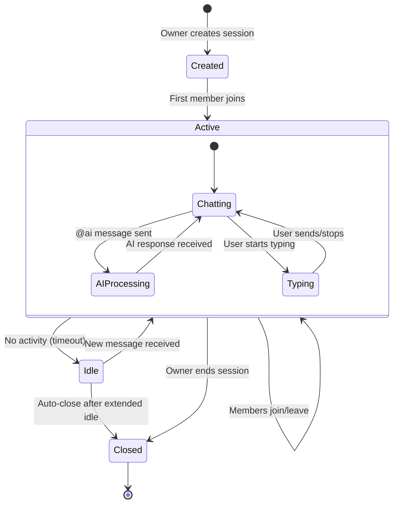

### 5.2 Group Invitation Lifecycle

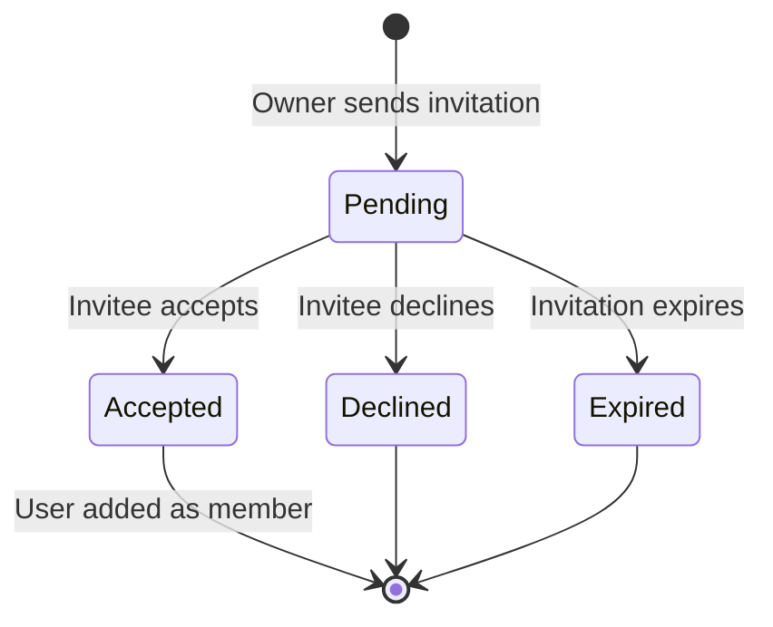

### 5.3 Report Generation Lifecycle

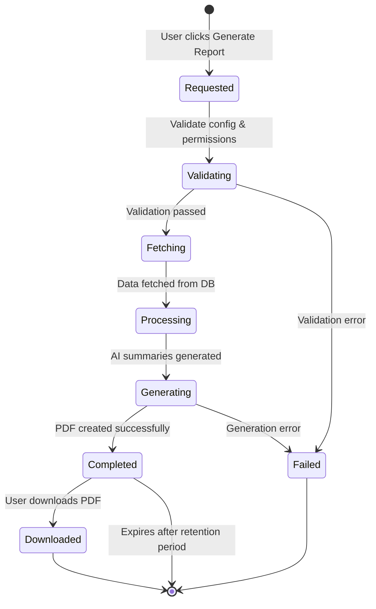

---

## 6. Component Diagram

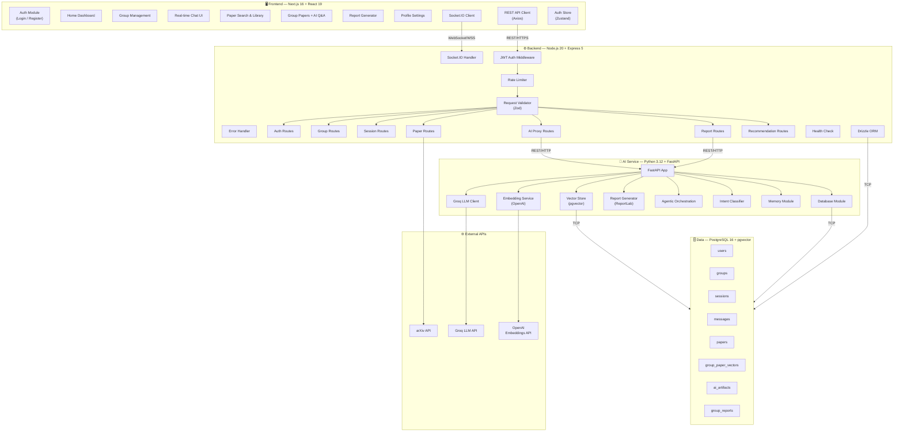

---

## 7. Deployment Diagram

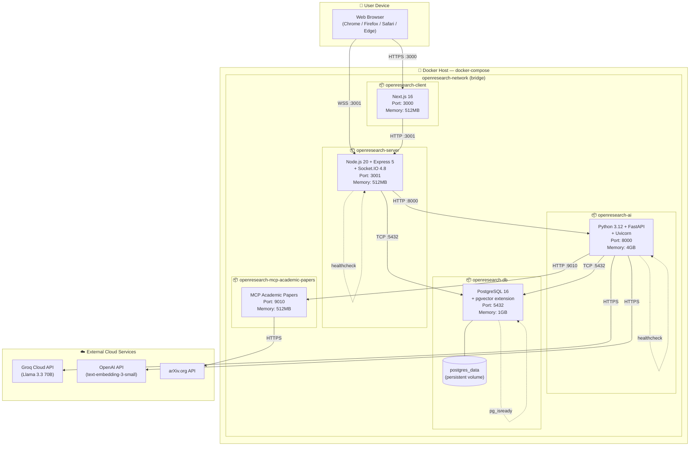

---

*Document Generated: February 10, 2026*
