# UML Diagrams — OpenResearch

**Version 2.0 — July 2026.** Regenerated against the implemented system; every
class, event, and endpoint below exists in the code.

## Contents

1. [Use Case Diagram](#1-use-case-diagram)
2. [Class Diagram](#2-class-diagram)
3. [Component Diagram](#3-component-diagram)
4. [Sequence Diagrams](#4-sequence-diagrams)
5. [Activity Diagrams](#5-activity-diagrams)
6. [State Machine Diagrams](#6-state-machine-diagrams)
7. [Deployment Diagram](#7-deployment-diagram)

---

## 1. Use Case Diagram

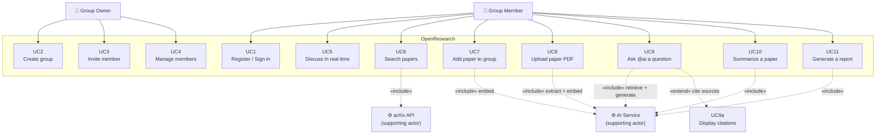

> **Owner generalises Member:** an owner may do everything a member may do, plus
> UC2–UC4.

---

## 2. Class Diagram

### 2.1 Domain model (persisted entities)

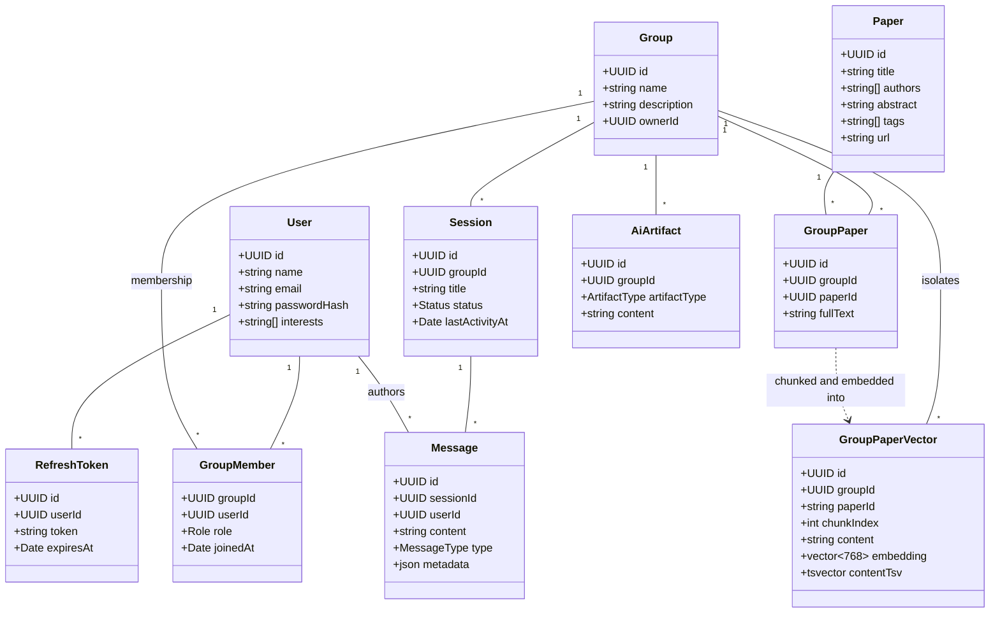

> `Message.metadata` carries the `sources` array for an AI message — the data the
> interface renders as citation chips.
>
> `GroupPaperVector.groupId` is the isolation boundary: **every** retrieval query
> filters on it.

### 2.2 AI service — class structure

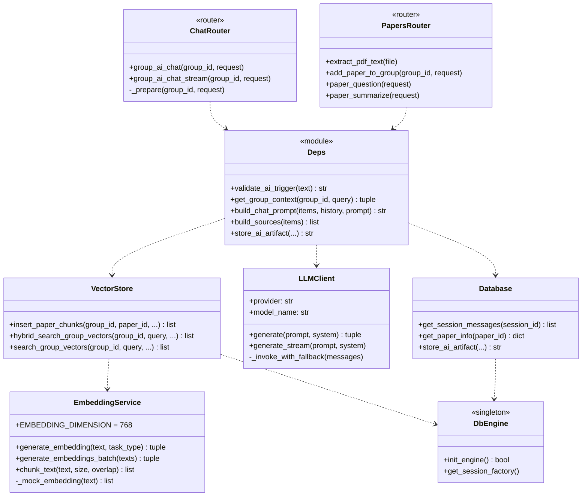

> Dependencies run in one direction only: **router → deps → (vector store | LLM
> client | database) → engine**. A router contains no SQL; the vector store knows
> nothing of HTTP.
>
> `DbEngine` is a single shared connection pool. Before the refactor, `Database`
> and `VectorStore` each opened their own.

### 2.3 Server — authorization middleware

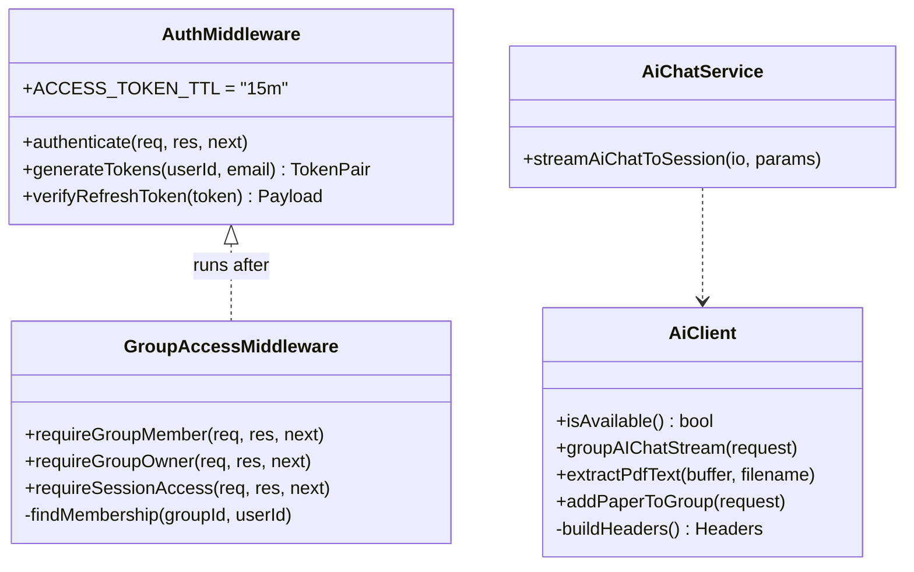

> `GroupAccessMiddleware` replaced 34 copy-pasted membership checks. Every
> group-scoped route now passes through it.

---

## 3. Component Diagram

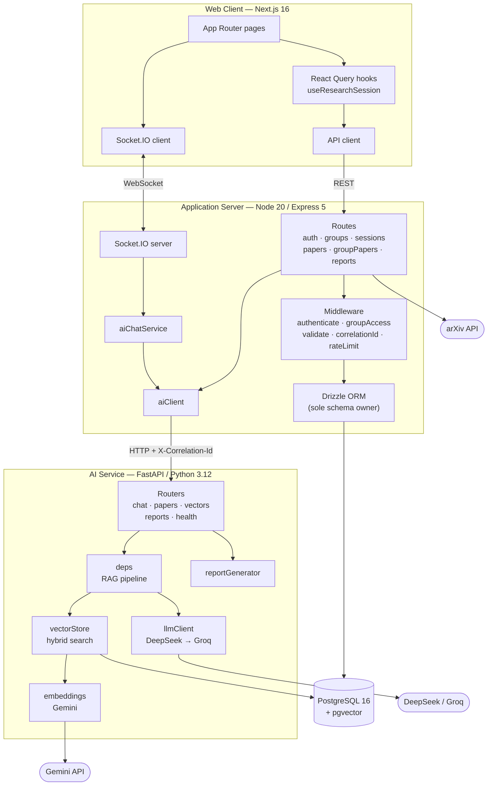

> Note the arrow that does **not** exist: the client never reaches the AI
> service. Every AI request is proxied by the server, which is why the `@ai` gate
> and authorization live in exactly one place.

---

## 4. Sequence Diagrams

### 4.1 `@ai` question — the flagship flow

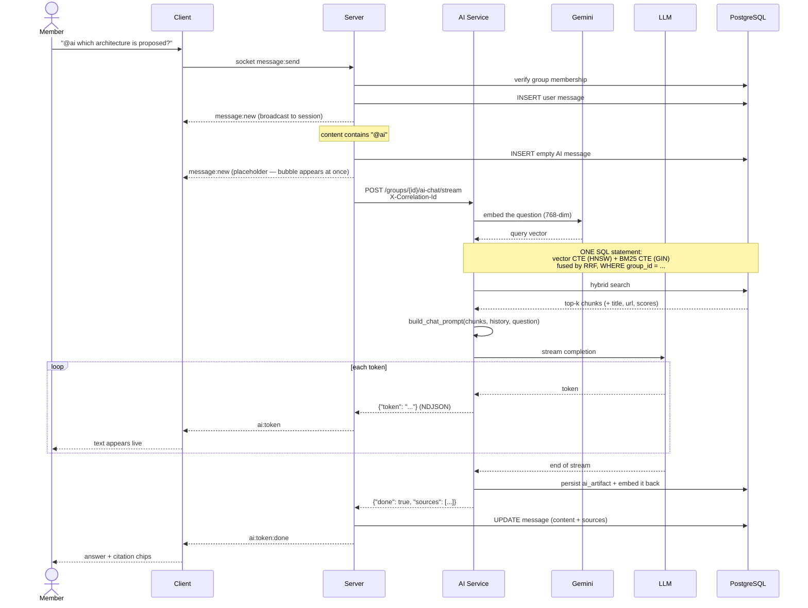

### 4.2 PDF upload and indexing

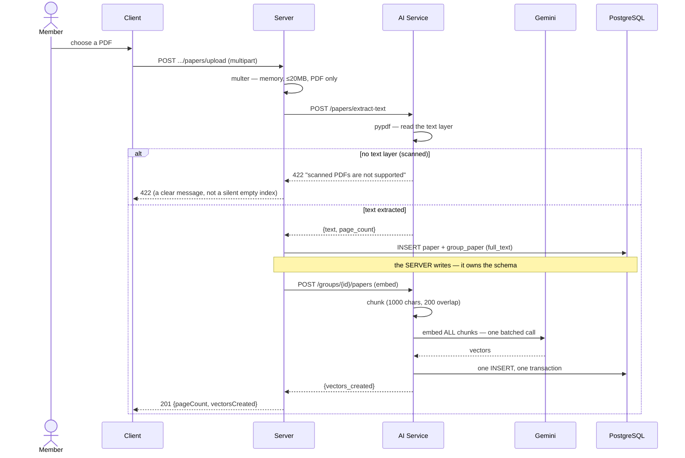

### 4.3 Authentication and token refresh

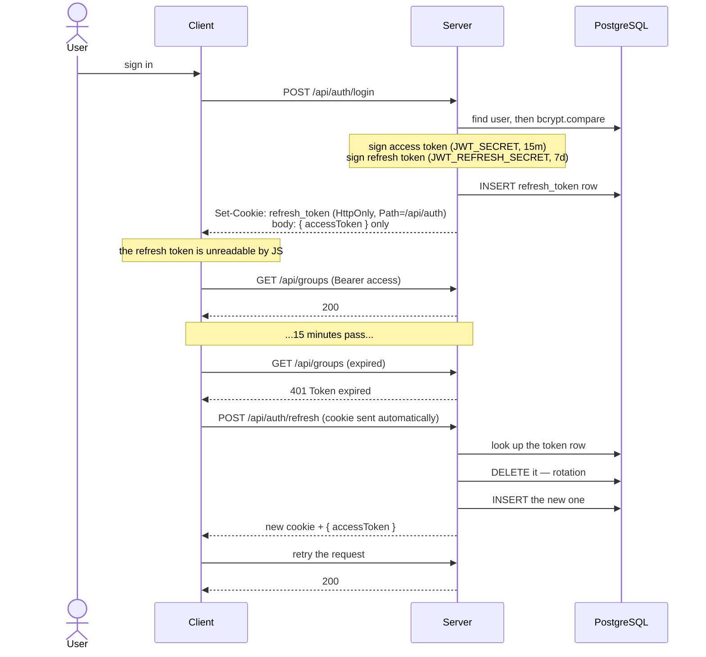

---

## 5. Activity Diagrams

### 5.1 Handling an incoming message

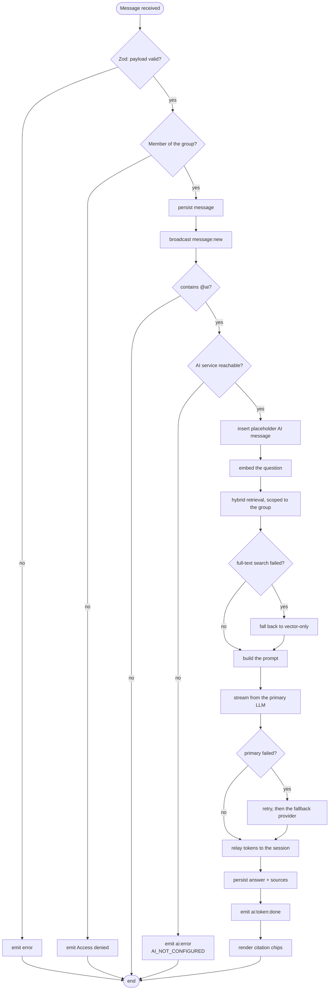

### 5.2 Retrieval — hybrid search and RRF

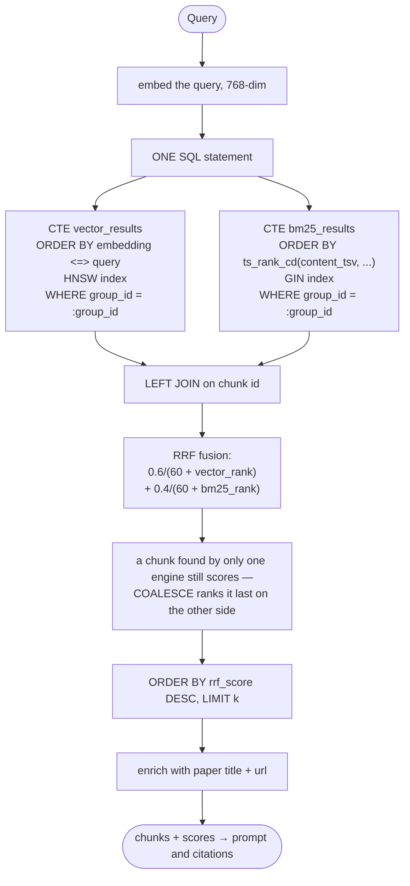

---

## 6. State Machine Diagrams

### 6.1 An AI message

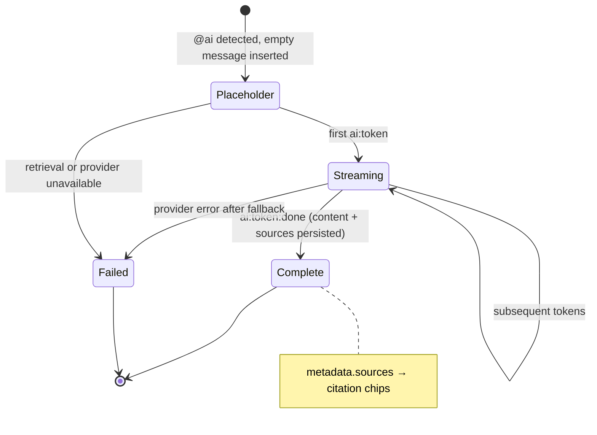

### 6.2 A group invitation

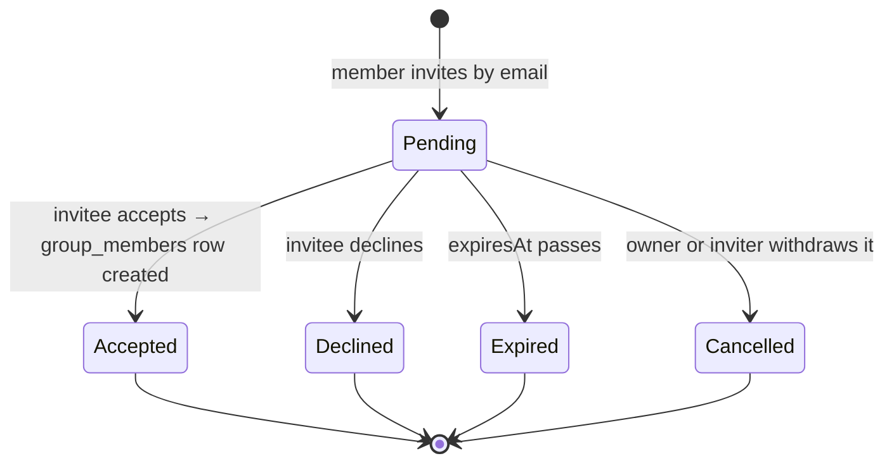

### 6.3 A refresh token

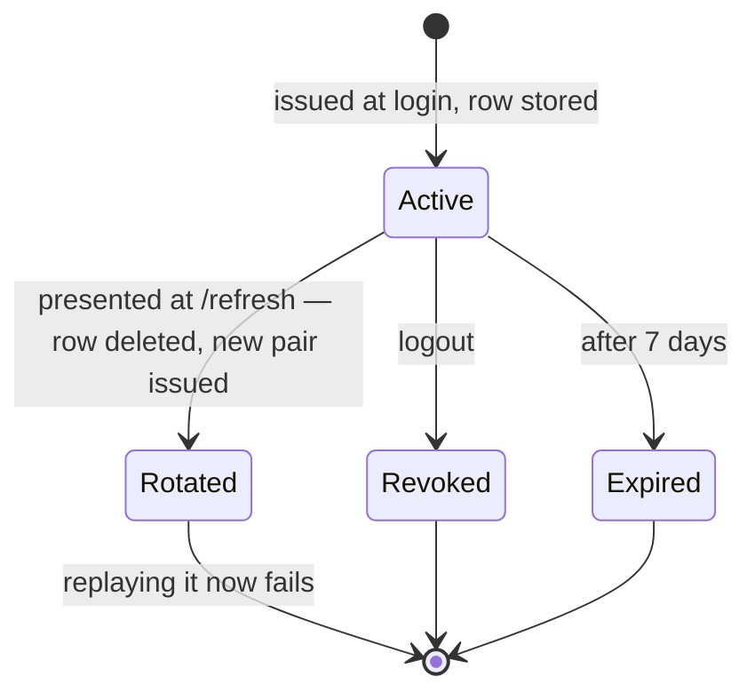

---

## 7. Deployment Diagram

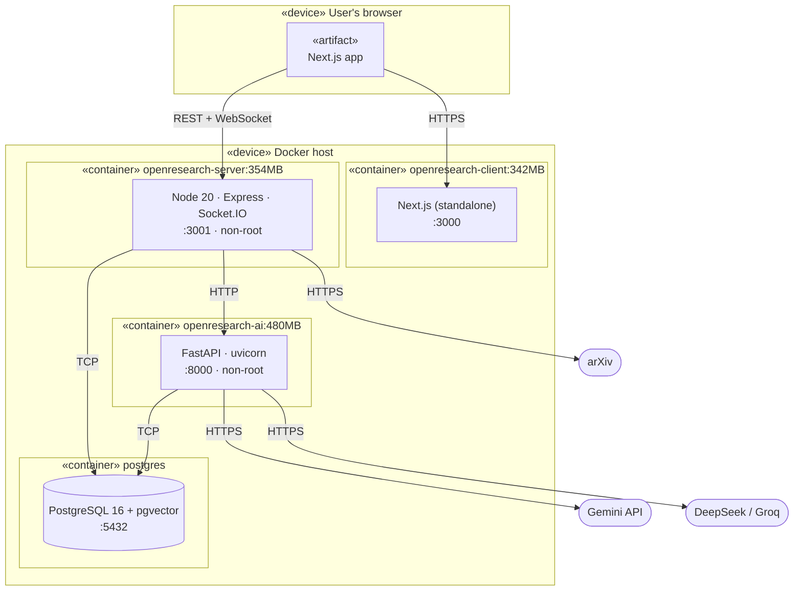

> The AI service is **not** published to the browser; only the server may reach
> it. Its image was 2.81 GB before the local transformer models were removed
> ([ADR 0003](adr/0003-hosted-embeddings.md)).
